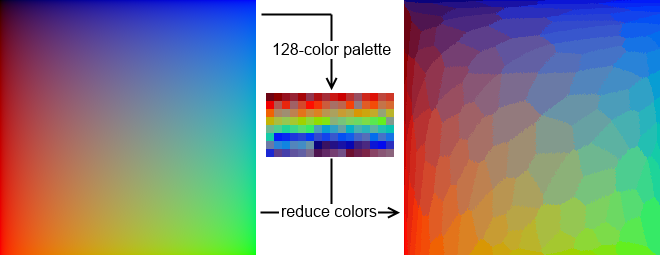

RgbQuant.js
-----------
an image quantization lib _(MIT Licensed)_



---
### Intro

Color quantization is the process of reducing an image with thousands or millions of colors to one with fewer (usually 256). The trick is to balance speed, cpu and memory requirements while minimizing the perceptual loss in output quality. More info can be found on [wikipedia](http://en.wikipedia.org/wiki/Color_quantization). Various algorithms can be found on [rosettacode.org](http://rosettacode.org/wiki/Color_quantization).

First, let me acknowledge the elephant in the room: why not just use or port an existing quantization algorithm? As far as JS ports go, there are really only 3.5 options (which implement 2.5 algos).

  - [Median-Cut](http://www.cs.tau.ac.il/~dcor/Graphics/cg-slides/color_q.pdf) - https://github.com/mwcz/median-cut-js<br>
    Not particularly fast.

  - [Leptonica's Modified Median-Cut](http://www.leptonica.com/color-quantization.html) - https://gist.github.com/nrabinowitz/1104622<br>
    This port is slow and contains major unfixed issues (see my gist comments/samples). Author seems to have abandoned updating the project.

  - [NeuQuant](http://members.ozemail.com.au/~dekker/NEUQUANT.HTML) - [port 1](https://github.com/antimatter15/jsgif/blob/master/NeuQuant.js), [port 2](https://github.com/jnordberg/gif.js/blob/master/src/TypedNeuQuant.js)<br>
    Performs quite well for photographs. Tends to favor smoothness/quality of large gradients over the retention of visually distinct, but less frequent hues. Also, can introduce edge artifacts when used with graphics since it's not designed for working with a small number of colors.

  - [Agglomerative hierarchical clustering](http://www.improvedoutcomes.com/docs/WebSiteDocs/Clustering/Agglomerative_Hierarchical_Clustering_Overview.htm) - http://harthur.github.io/clusterfck/<br>
    I only discovered this one recently. It's not quite a full quantization lib, but seems to do the important parts. Rather slowly though :(

My original goal was to upscale frames from `<canvas>` graphics animations and pixelated SNES-style games for [GIFter.js](https://github.com/leeoniya/GIFter.js). It became apparent after trying the first three options that I would need something different.

RgbQuant.js is not a port or implementation of any specific quantization algorithm, though some overlap is inevitable.

---
### Usage

**Use Chrome or Firefox** since many HTML5/JS features are used. Canvas, Typed Arrays, Array.forEach.

```js
// options with defaults (not required)
var opts = {
    colors: 256,        // desired palette size
    method: 2,          // histogram method, 2: min-population threshold within subregions; 1: global top-population
    boxSize: [64,64],   // subregion dims (if method = 2)
    boxPxls: 2,         // min-population threshold (if method = 2)
    initColors: 4096,   // # of top-occurring colors  to start with (if method = 1)
	minHueCols: 0,		// # of colors per hue group to evaluate regardless of counts, to retain low-count hues
};

var q = new RgbQuant(opts);

// analyze histograms
q.sample(imgA);
q.sample(imgB);
q.sample(imgC);

// build palette
var pal = q.palette();

// reduce images
var outA = q.reduce(imgA),
    outB = q.reduce(imgB),
    outC = q.reduce(imgC);
```

---
### Docs

**.sample(image, width)** - Performs histogram analysis.<br>
`image` may be any of *&lt;img&gt;*, *&lt;canvas&gt;*, *Context2D*, *ImageData*, *Typed Array*, *Array*. `width` is required if `image` is an array.

**.palette(tuples)** - Retrieves the palette, building it on first call.<br>
Returned type is a Uint8Array unless `tuples` is `true`, then an array of `[r,g,b]` tuples.

**.reduce(image, retType)** - Quantizes an image.<br>
`image` can be any of the types specified for `.sample()` above. `retType` determines returned type. `1` - Uint8Array (default), `2` - Indexed array. Transparent pixels will result in a sparse indexed array.

---
### Caveats & Tips

RgbQuant.js, as any quantizer, makes trade-offs which affect its performance in certain cases. Some parameters may be tweaked to improve the quality of the output at the expense of palette computation and reduction speed. Since the methods used to determine the palette are based on occurrence counts of each pixel's color, three problematic situations can arise.

- No two pixels are the same color. eg: unscaled bidirectional gradients.
- Visually distinctive but low-density hues are overwhelmed by dissimilar, dominating hues. (see Quantum Frog)
- Hues are numerous and densities relatively equal such that choosing the 'top' ones is unpredictable and eliminates a large number of important ones. (see Fish)

The symptom of these issues is a lack of important color groups in the final palette which results in poorly reduced images.

Frequently, the solution is to set `minHueCols: 256` during instantiation. What this will do is inject the first 256 encountered distinct colors for each hue group (by default there are 10) into the initial palette for analysis. In effect, it forces each encountered hue group to be represented, regardless of specific color counts. If using `method: 1`, you may additionally increase `initColors` to advance the slicing point of the frequency-sorted initial histogram.

These adjustments come with a (often significant) speed penalty for palette generation. Reduction passes may also be affected because of the internal memoization/caching used during palette building.
